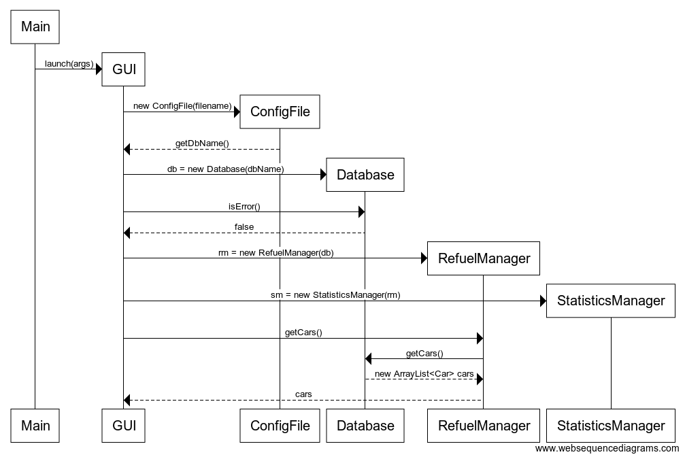
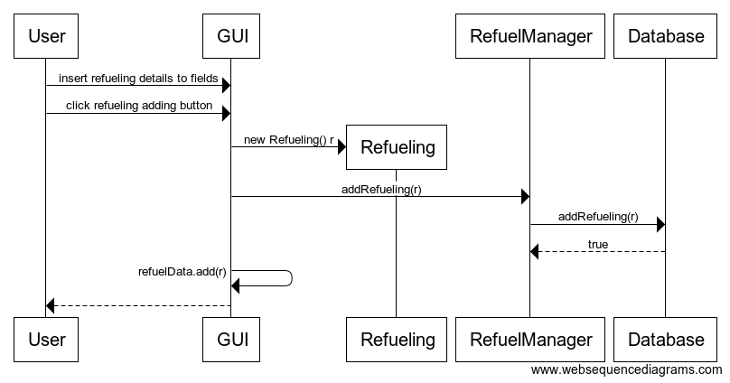

# Architecture

## Structure

* _fuellogger.ui_ contains a graphical user interface.
* _fuellogger.logic_ contains the main application logic that manages
cars and refuelings. It also performs calculations used for statistic
views and charts. 
* _fuellogger.domain_ contains the Car and Refueling classes that are
used to store information in the application.
* _fuellogger.dao_ contains classes used to save data into the hard
disk. (SQLite database and config file)

## Class diagram


## Application logic
Application logic is implemented with the _RefuelManager_ and
_StatisticsManager_ classes. 
* __RefuelManager__ manages and stores cars and refuelings. It also
uses _Database_ class to store data to the database. 
	* Adding a car
	* Listing of cars
	* Adding a refueling
	* Listing of refuelings
	* Listing of refuelings by month and year
* __StatisticsManager__ performs calculations to be displayed in the
graphical 
	* Getting statistics of a car
	* Getting statistics of refuelings
	* Output data to generate charts in the GUI


Logic classes use the _Car_ and _Refueling_ classes from _fuellogger.domain_
package to store the information locally. _RefuelingManager_ uses 
_Database_ class from _fuellogger.dao_ package to save the data to a
SQLite database. 

## Data storage
### Database
This application uses a SQLite database to save the Car and Refueling
objects. __Database__ class handles reading and inserting to the
database. The database file is created and read to the
directory where the application is executed. By default the name of the
file is _database.db_. The database uses ```UNIQUE``` constraints to
avoid duplicate entries in the database. 

#### Database schema
```
CREATE TABLE Car (id INTEGER PRIMARY KEY, name TEXT UNIQUE, fuel_capacity INTEGER NOT NULL);
CREATE TABLE Refueling (id INTEGER PRIMARY KEY, car_id INTEGER, odometer INTEGER UNIQUE,
volume REAL, day INTEGER, month INTEGER, year INTEGER, price REAL);
```

### Config file
There is a configuration file called _fuellogger.conf_ that is used to
specify the database file SQLite uses. The configuration file is created
automatically with the default value if no such file exists. There is no
need to create the config file manually. There is currently no way
to validate if the config file is correct. It is only checked if the
file exists. However in case the file is missing or it doesn't contain
the dbname property, default value _database.db_ is used instead.

The configuration file looks like this:
```dbname=database.db```


## Sequences

### Startup sequence


JavaFX GUI is launched. GUI creates a new ConfigFile. Database name
value is read from ConfigFile. A new Database is created with dbName.
A new RefuelManager is created with the Database. A new StatisticsManager
is created with RefuelManager. GUI asks RefuelManager for a list of
cars. RefuelManager fetches cars from the Database. A list of cars is
shown in the GUI.

### Car adding sequence diagram


User inserts car's details in fields and clicks car adding button. 
A new car object is created and addCar() method in RefuelingManager
class is called. RefuelManager tries to add car into the Database with
Database's addCar() method. If it returns true the car is also added
into RefuelManager's local ArrayList of cars. The created car object is
added to GUIs observablelist.

### Refueling adding sequence diagram


User inserts refueling details in fields and clicks adding button. 
A new refueling object is created and addRefueling() method in
RefuelingManager class is called. RefuelManager calls Database's
addRefueling(). If it returns true, the refueling is also added into
RefuelingManager's local HashMap of <Car, Refueling> pairs.
Databases addRefueling() tries to insert refueling into the database, if
the insertion is success it returns true. The created refueling object
is added to GUIs observablelist.
